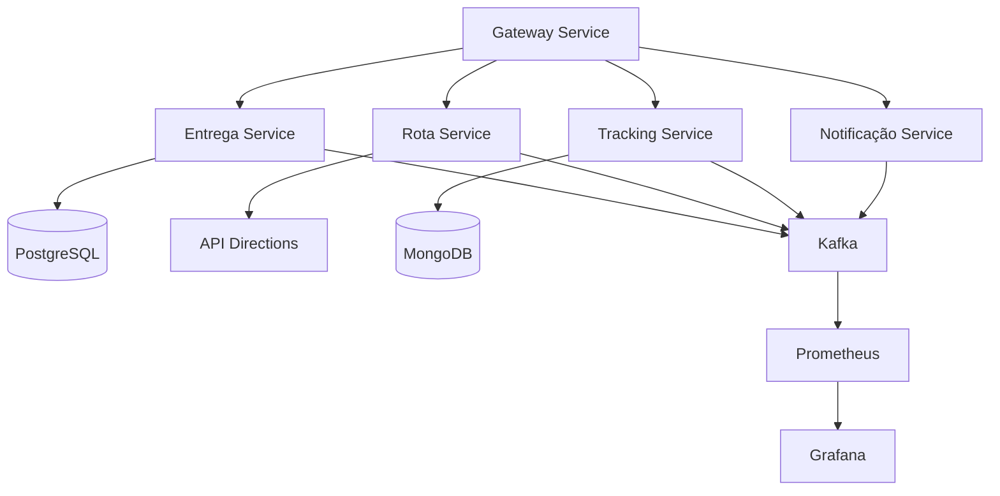

# Otimizador de Rotas de Entrega - Projeto Inteligente Java + DevOps


## 📌 Visão Geral

Este projeto visa criar uma solução inteligente para otimização de rotas de entrega para transportadoras locais, combinando tecnologias Java modernas com práticas de DevOps. O sistema permite gerenciar entregas, calcular rotas otimizadas e monitorar todo o processo em tempo real.

## 🚀 Funcionalidades Principais

- **CRUD Completo**:
  - Gerenciamento de entregas, motoristas e destinos
  - Atualização em tempo real do status das entregas

- **Otimização de Rotas**:
  - Integração com APIs de mapeamento (Google Directions ou similar)
  - Cálculo da rota mais eficiente para múltiplas entregas

- **Eventos em Tempo Real**:
  - Publicação de eventos para cada etapa do processo
  - Atualização automática do status (em rota, entregue, etc.)

- **Monitoramento**:
  - Painel com métricas de desempenho
  - Observabilidade completa com Prometheus e Grafana

- **Infraestrutura Moderna**:
  - Arquitetura de microsserviços
  - Containerização com Docker
  - CI/CD automatizado com GitHub Actions

## 🏗️ Arquitetura do Sistema



## 📦 Estrutura do Projeto

```
entregas-otimizadas/
│
├── entrega-service/          # Microsserviço de gestão de entregas
│   ├── src/
│   ├── Dockerfile
│   └── pom.xml
│
├── rota-service/             # Serviço de cálculo de rotas
│   ├── src/
│   ├── Dockerfile
│   └── pom.xml
│
├── notificacao-service/      # Serviço de notificações
│   ├── src/
│   ├── Dockerfile
│   └── pom.xml
│
├── tracking-service/         # Serviço de rastreamento
│   ├── src/
│   ├── Dockerfile
│   └── pom.xml
│
├── user-service/             # Serviço de autenticação
│   ├── src/
│   ├── Dockerfile
│   └── pom.xml
│
├── gateway-service/          # API Gateway
│   ├── src/
│   ├── Dockerfile
│   └── pom.xml
│
├── discovery-server/         # Service Discovery
│   ├── src/
│   ├── Dockerfile
│   └── pom.xml
│
├── docker-compose.yml        # Orquestração de containers
├── k8s/                     # Configurações Kubernetes
├── .github/workflows/        # Pipelines CI/CD
└── README.md
```

## 🛠️ Tecnologias Utilizadas

- **Backend**: Java 21, Spring Boot 3, Spring Cloud, Spring Data
- **Banco de Dados**: PostgreSQL (entregas), MongoDB (tracking)
- **Mensageria**: Apache Kafka
- **Autenticação**: JWT com Spring Security
- **Documentação**: SpringDoc OpenAPI (Swagger UI)
- **Monitoramento**: Prometheus, Grafana, Spring Boot Actuator
- **Containerização**: Docker, Docker Compose
- **CI/CD**: GitHub Actions
- **Testes**: JUnit 5, TestContainers, Mockito

## 🚀 Como Executar o Projeto

### Pré-requisitos

- Java JDK 21
- Docker e Docker Compose
- Maven 3.8+
- Conta no Docker Hub (para CI/CD)

### Executando com Docker Compose

1. Clone o repositório:
```bash
git clone https://github.com/SdneyFernandes/entregas-otimizadas.git
cd entregas-otimizadas
```

2. Construa e inicie os containers:
```bash
docker-compose up --build
```

3. Acesse os serviços:
- API Gateway: http://localhost:8080
- Swagger UI: http://localhost:8080/swagger-ui.html
- Grafana: http://localhost:3000
- Prometheus: http://localhost:9090

## 📚 Documentação da API

A documentação completa da API está disponível via Swagger UI em:
```
http://localhost:8080/swagger-ui.html
```

Cada microsserviço também possui sua própria documentação Swagger acessível através do gateway.

## 🧪 Testes

Para executar os testes unitários e de integração:

```bash
mvn test
```

Os testes de integração utilizam TestContainers para criar ambientes isolados com bancos de dados reais em containers Docker.

## 🔄 CI/CD

O projeto está configurado com GitHub Actions para:

1. **Build e Testes**: Executados em cada push
2. **Análise de Código**: SonarQube integration
3. **Deploy Automático**: Para ambientes de staging quando mergado na branch `main`
4. **Geração de Imagens Docker**: Publicadas no Docker Hub

## 🤝 Contribuição

Contribuições são bem-vindas! Siga estes passos:

1. Faça um fork do projeto
2. Crie uma branch para sua feature (`git checkout -b feature/awesome-feature`)
3. Commit suas mudanças (`git commit -m 'Add some awesome feature'`)
4. Push para a branch (`git push origin feature/awesome-feature`)
5. Abra um Pull Request

## 📄 Licença

Este projeto está licenciado sob a licença MIT - veja o arquivo [LICENSE](LICENSE) para detalhes.

## ✉️ Contato

Para dúvidas ou sugestões, entre em contato:

- Email: fsidney987@gmail.com
- LinkedIn: (www.linkedin.com/in/sdney-da-encarnação-pereira-fernandes)

---

Desenvolvido com ❤️ por [Sdney Fernandes] - 2025
